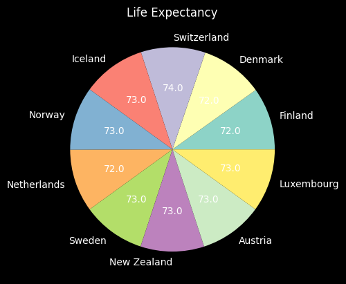
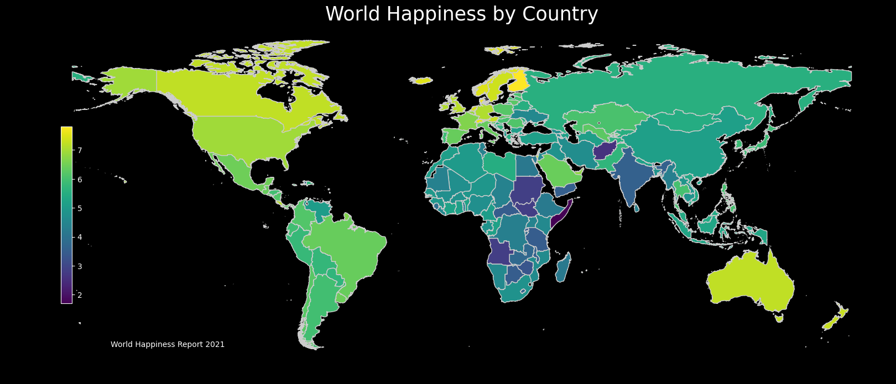
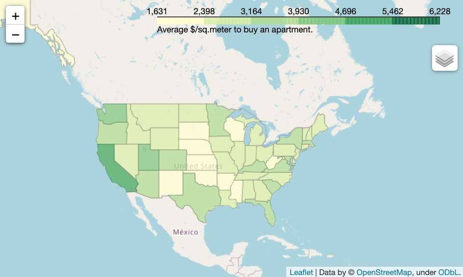
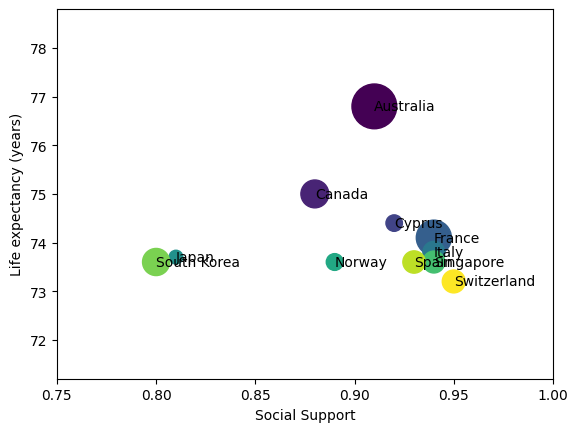

# Code Review: Team Week

#### By Ruben Giosa, Alejandro Socarras, Drew White

#### This repo includes exercises for working with datasets using pandas working as a team. 

<br>

## Technologies Used

* Python
* Pandas
* GeoPandas
* Matplot
* Folium
* Git
* Markdown
* JSON
* NumPy
* `.gitignore`
* `requirements.txt`
  
</br>

## Datasets Used

1. [USA Real Estate Data](https://www.kaggle.com/datasets/ahmedshahriarsakib/usa-real-estate-dataset)
2. [Global Cost of Living](https://www.kaggle.com/datasets/mvieira101/global-cost-of-living)
3. [World Happiness Report 2021](https://www.kaggle.com/datasets/ajaypalsinghlo/world-happiness-report-2021)
4. [World Happiness Ranking](https://www.kaggle.com/datasets/anamvillalpando/world-happiness-ranking)

</br>

## Description

This repo includes data manipulation for datasets working with a team. Alejandro performed profiling, cleaning and transformations on the Cost of Living data, and exported to a clean version of the csv named `cost_living.csv`. Drew worked on profiling, cleaning and transformations for the World Happiness and Global Quality of Life data sets to merge into `world_happiness_clean.csv`. Ruben performed profiling, cleaning and transformations on the Realtor data (`clean_realtor_data.csv`), and then joined the other contributors' datasets into one consolidated csv file. The realtor and cost of living data were concatenated in order to expand the data set for price per square meter data at the city level. Then that expanded data (`cost_living_with_realtor.csv`) set was merged with `world_happiness_clean.csv` into the consolidated `cl_real_happiness.csv`.

Once the datasets were cleaned and consolidated, the team created (and in some cases recreated) data visualizations and analysis using `cl_real_happiness.csv`. In the `rg_maps.ipynb` notebook is a geo heat map of life expectancy by country that was put together by Ruben. Below is the output of the visualization:

<br>


Drew put together a pie chart highlighting the life expectancy for the top 10 countries. Code for the visualization is located in `dw.ipynb`. Below is the pie chart:

<br>



Drew also put together a line graph highlighting the happiness score for the top 10 countries. Interesting note is there seems to be correlation between Happiness and Life Expectancy with the two showing the same exact top ten countries. Code for the visualization is located in `dw.ipynb`. Below is the line chart:

<br>


<br>

Drew compiled a map highlighting the happiness score for all countries. Code for the visualization is located in `dw.ipynb`. Below is the output of the visualization:



<br>

Alejandro put together a map visualization using Folium, that shows the average price per square meter by state. Code for the visualization is located in `alex_work.ipynb`. Below is a snapshot of the visualization, as it is a dynamic map so in the notebook you can zoom in and out:



Ruben created a scatter plot visualization that shows the average price per square meter against life expectancy and social support, for 10 countries with the highest life expectancy. Code for the visualization is located in `rg_scatter.ipynb`. Below is a snapshot of the visualization:



Overall, the team was able to limit the amount of merge conflicts by working on independent notebooks and assigning different tasks (e.g. Ruben focused on README). One challenge that we underwent was version control for the datasets that were transformed and then needed to be leveraged by the broader group. Going forward a good practice to help resolve this is to spend time as a group validating the final data set, agree its ready to be leveraged, and then go on to begin our data visualizations and exploration. 

## Setup/Installation Requirements

* Go to https://github.com/apsocarras/team-week.git to find the specific repository for this website.
* Then open your terminal. I recommend going to your Desktop directory:
    ```bash
    cd Desktop
    ```
* Then clone the repository by inputting: 
  ```bash
  git clone https://github.com/apsocarras/team-week.git
  ```
* Go to the new directory or open the directory folder on your desktop:
  ```bash
  cd python-team-week
  ```
* Once in the directory you will need to set up a virtual environment in your terminal:
  ```bash
  python3.7 -m venv venv
  ```
* Then activate the environment:
  ```bash
  source venv/bin/activate
  ```
* Install the necessary items with requirements.txt:
  ```bash
    pip install -r requirements.txt
  ```
* Download the necessary csv files listed in the Datasets Used section
* Download the cleaned up csv files created by the contributors on this [google drive](https://drive.google.com/drive/folders/1lq9CVXbi3C3INEUpxUeNBACZHR3vWxhE)
* One all csv data sets have been added to the data folder in this directory, you can open it
* With your virtual environment now enabled with proper requirements, open the directory:
  ```bash
  code .
  ```
</br>

## Known Bugs

* No known bugs

<br>

## License

MIT License

Copyright (c) 2022 Ruben Giosa, Alejandro Socarras, Drew White

Permission is hereby granted, free of charge, to any person obtaining a copy of this software and associated documentation files (the "Software"), to deal in the Software without restriction, including without limitation the rights to use, copy, modify, merge, publish, distribute, sublicense, and/or sell copies of the Software, and to permit persons to whom the Software is furnished to do so, subject to the following conditions:

The above copyright notice and this permission notice shall be included in all copies or substantial portions of the Software.

THE SOFTWARE IS PROVIDED "AS IS", WITHOUT WARRANTY OF ANY KIND, EXPRESS OR IMPLIED, INCLUDING BUT NOT LIMITED TO THE WARRANTIES OF MERCHANTABILITY, FITNESS FOR A PARTICULAR PURPOSE AND NONINFRINGEMENT. IN NO EVENT SHALL THE AUTHORS OR COPYRIGHT HOLDERS BE LIABLE FOR ANY CLAIM, DAMAGES OR OTHER LIABILITY, WHETHER IN AN ACTION OF CONTRACT, TORT OR OTHERWISE, ARISING FROM, OUT OF OR IN CONNECTION WITH THE SOFTWARE OR THE USE OR OTHER DEALINGS IN THE SOFTWARE.

</br>
